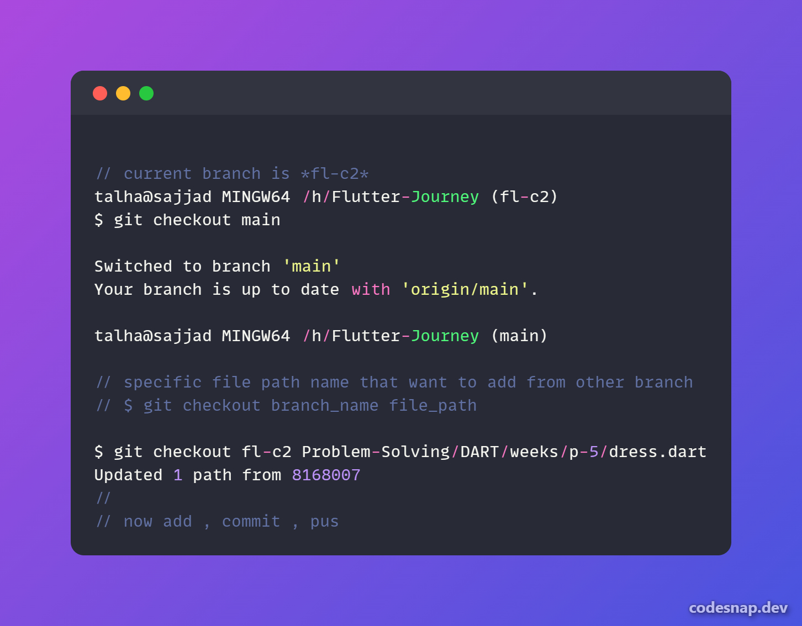

# Flutter-Journey 🚀
- Road to Flutter developer
- Welcome to the **Flutter Journey** repository! This repository is dedicated to sharing my journey of learning Flutter and Dart.
- Here, you'll find code examples, projects, and resources related to Flutter and Dart.
  
## Table of Contents

- [Getting Started](#getting-started)
- [Contributing](#contributing)
- [Project Structure](#project-structure)
- [Git Merge](#git-merge)
- [License](#license)

## Getting Started

- If you're new to Flutter and Dart, you can start by [forking](link-to-forking) and [cloning](link-to-cloning) this repository to your local machine. We've also provided a [Contribution Guidelines](CONTRIBUTING.md) document to help you get started with contributing to this repository.

## Contributing

- We welcome contributions from the community. 
- Please read our [Code of Conduct](CODE_OF_CONDUCT.md) and [Contribution Guidelines](CONTRIBUTING.md) before making any contributions.

## Project Structure

Here's a brief overview of the project structure:

- `Dart Language/`: About Basic Dart programming language and syntax
- `Problem-Solving/`: Few problem-solving examples with Java or Dart
- `images/`: Images for general use
- `Flutter-Projects/`: Flutter Projects are here

### Git Merge

- Learn how to add specific files/folders from another branch
- 

## License
This project is licensed under the [MIT License](LICENSE.md).

---

Connect with me on social platforms:
- [LinkedIn](https://www.linkedin.com/in/sajjadrahman56/)
- [Twitter](https://twitter.com/sajjadrahman56)

